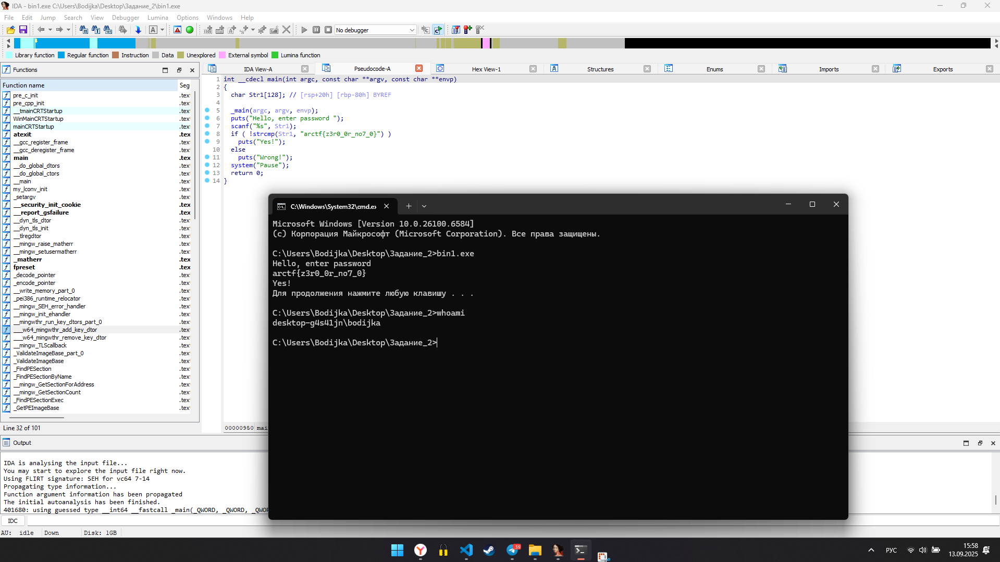
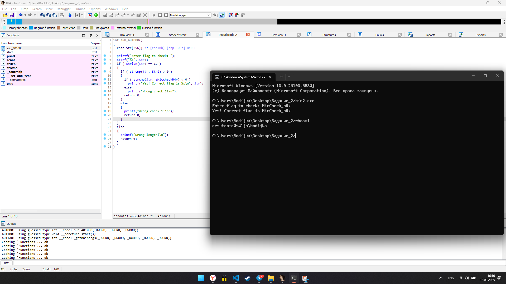
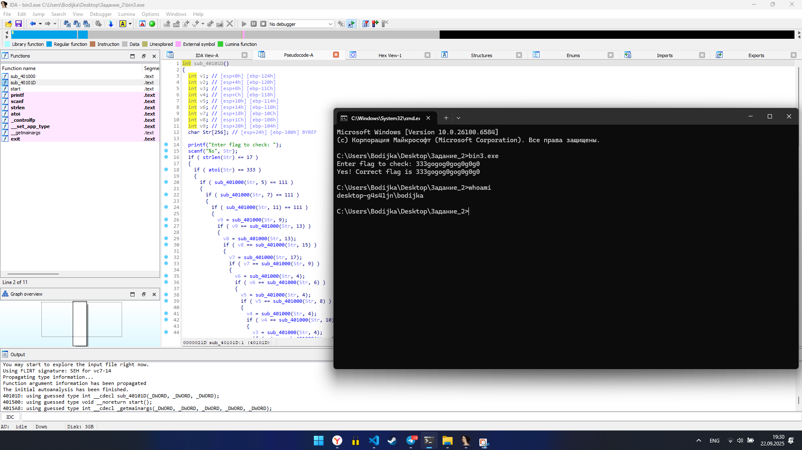
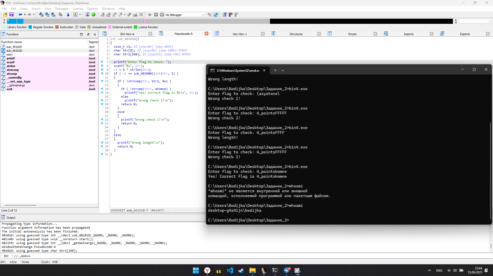
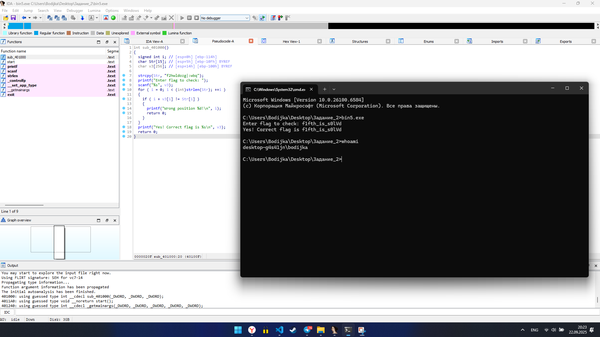

# bin1.exe

В данном бинарнике все предельно просто, программа запрашивает на ввод строку и посимвольно (с помощью `strcmp`) сверяет ее с строкой `"arctf{z3r0_0r_no7_0}"`.

### Ответ: `arctf{z3r0_0r_no7_0}`

# bin2.exe

В программе есть константы:

- `Str2 = "MicCheck_h4w"`

and

- `aMiccheckH4y = "MicCheck_h4y"`

В первом условии функция `strcmp` должна выдать значение > 0 при сравнении с `strcmp`, а во втором условии < 0 при строке `aMiccheckH4y`. Можно предположить что правильный ответ находится между буквами `w` и `y` - это буква `x`.

*p.s.*
**Функция возвращает одно из трёх значений:**

***0** — если все символы по заданным индексам в обеих строках одинаковы.*

***Больше нуля** — если первый несовпадающий символ в первой строке имеет большее значение ASCII, чем соответствующий символ во второй строке.*

***Меньше нуля** — если первый несовпадающий символ в первой строке имеет меньшее значение ASCII, чем соответствующий символ во второй строке.*

### Ответ: `MicCheck_h4x`

# bin3.exe

Первым условием в проверке пароля является проверка длины - она должна быть равна **17**

Так же, в программе есть еще одна функция sub_401000 - выборка символа по индексу.

Далее должны идти буквы `о`, их номера, соответственно: `4, 6, 10`

Мы видим зависимость, что эти символы одинаковы: 

Str[3] = Str[5] = Str[7] = Str[9] = Str[11] = Str[13] = Str[15]
В свою очередь Str[15] = `'g'`

Аналогичная ситуация и тут: Str[8], Str[12], Str[14], Str[16]
Где str[8] = `'0'`

### Ответ: `333gogog0gog0g0g0`

# bin4.exe

Первым делом, переменная `v1 = 4 * длинна введеной строки`

Далее идет функция `sub_401000(Str, 1)`, которая говорит нам о том, что первый введенный символ должен быть номером символа из ASCII, который хранится в переменной `v1`.

Затем, `strncmp(Str, Str2, 8u)` сравнивает строки, но уже до первых 8-ми.

Где `Str2 = '4_points'`. Cледовательно первый символ пароля это `4`, а общее кол-во символов в пароле `52 : 4 = 13`

Далее известная нам `strcmp` cравнивает `Str1` и `aKomne = "komne"` 
Значит итоговый пароль это `'4_points'` (8 символов) и `'komne'` (5 символов), где их сумма 8 + 5 = 13 (без пробела), что и соответствует условию длины флага.

### Ответ: `4_pointskomne`

# bin5.exe

Программа проверяет, что каждый символ введенной строки, сложенный со своим индексом, дает соответствующий символ из зашифрованной строки `f2hwldozg|:wbq`.

Сделаем это для каждого элемента.

`'f' = 102   -0 = 102 = 'f'`

`'2'	= 50    -1 = 49  = '1'`

`'h'    = 104	-2 = 102	= 'f'`

`'w'	= 119	-3	= 116	= 't'`

`'l'	= 108	-4	= 104	= 'h'`

`'d'	= 100	-5	= 95	= '_'`

`'o'	= 111	-6	= 105	= 'i'`

`'z'	= 122	-7	= 115	= 's'`

`'g'	= 103	-8	= 95	= '_'`

`'|'    = 124	-9	= 115 = 's'`

`':'	= 58	-10	= 48	='0'`

`'w'	= 119	-11	= 108	='l'`

`'b'	= 98	-12	= 86	='V'`

`'q'	= 113	-13	= 100	='d'`

### Ответ: `f1fth_is_s0lVd`