# bin1.exe

Минуя кучи функций и строк, которые нацелены на создание и визуал стандартного окна Windows, находим функцию под названием sub_140001260.

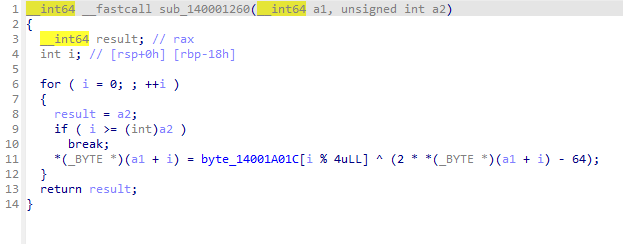

Тут наша введенная строка обрабатывается этой функцией. Над вводом происходит: умложение, затем вычитаение и XOR с ключом размерностью **4 байта**. Далее следует сравнение с тем, что уже хранится в программе (Наш флаг, который шифрован теми же действиями). Но это все обратимо, мы знаем то, какой у нас шифрованый флаг и мы знаем те 4 байта которыми XOR-ится строка.

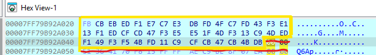
Шифрованый флаг

Можно написать python cкрипт, который на выходе даст нам флаг.

``` python


data_bytes = (
    0xFB, 0xCB, 0xEB, 0xED, 0xF1, 0xE7, 0xC7, 0xE3,
    0xDB, 0xFD, 0x4F, 0xC7, 0xFD, 0x43, 0xF3, 0xE1,
    0x13, 0xF1, 0xED, 0xCF, 0xCD, 0x47, 0xF3, 0xE5,
    0xE5, 0x1F, 0x4D, 0xF3, 0x13, 0xC9, 0x4D, 0xED,
    0xF1, 0x49, 0xF3, 0xF5, 0x4B, 0xFD, 0x11, 0xC9,
    0xCF, 0xCB, 0x47, 0xCB, 0x4B, 0xDB
)

key_stream = bytes([0x6D, 0x61, 0x6F, 0x6F])

result_chars = []

index = 0
while index < len(data_bytes):
    mixed = data_bytes[index] ^ key_stream[index & 3]
    decoded = (mixed + 64) >> 1
    result_chars.append(chr(decoded))
    index += 1

final_key = "".join(result_chars)

print(f"Key: {final_key}")

```

### Ответ: `kubanctf{n0th1ng_happ3ned_1n_t1an4nm3n_squ4r3}`

# bin2.exe

*No writeup*

# bin3.exe

Тут наша введённая строка дополнительно обрабатывается функцией `swaper`. Она разбивает строку на блоки фикс. размера. Этот блок символов просто переворачивается, остальная часть строки остаётся без изменений.
Таким образом, строка просто искажается за счёт перестановки символов. 

Вот пример **(ABCDEFGH, 4) -> (dcbaEFGH)** 
*Регистр изменен для наглядности, сама функция никак не меняет регистр*

Код, который имитирует работу бинаря: 
``` python
def flip_blocks(text: str, step: int) -> str:
    chars = list(text)
    size = len(chars)

    pos = 0
    operations = 0

    while pos + step < size + 1:
        left = pos
        right = pos + step - 1

        if right >= size:
            break

        chars[left], chars[right] = chars[right], chars[left]
        operations += 1
        pos += step

    return "".join(chars)


def process_string(data: str):
    if data is None:
        print("Передайте строку")
        return None

    if len(data) >= 128:
        print("Слишком большая строка")
        return None

    for block in reversed(range(2, 11)):
        data = flip_blocks(data, block)

    return data


if __name__ == "__main__":
    sample = "ABCDEFGH"
    print(process_string(sample))
```

# bin4.exe

Сразу цепляемся за `{O3IZ_5VFI3Y_7PDDJ0IA_7XI_SI1CY_Q4PL}`. Далее в массив `flag_buff` идут значения. После - `decrypt`.
В ней функция находит мультипликативно обратное число для a по модулю **26**. Затем идёт проход по каждому символу строки `message`.

Для каждой буквы выполняется расшифровка **аффинного шифра**.

После выполнения `decrypt` запускается цикл, который XOR-ит каждый байт из `flag_buff` с соответствующим символом из расшифрованного `message`.

Чтобы получить корректный результат, нужно подобрать правильные значения a и b. Можно написать python скрипт который займется перебором.

``` python

cipher_text = "{O3IZ_5VFI3Y_7PDDJ0IA_7XI_SI1CY_Q4PL}"

def inv_mod(val, mod):
    for cand in range(1, mod):
        if (val * cand) % mod == 1:
            return cand
    return None


def affine_decode(text, k1, k2):
    inv = inv_mod(k1, 26)
    if inv is None:
        return None

    out = []
    for ch in text:
        if 'A' <= ch <= 'Z':
            idx = ord(ch) - 65
            idx = (idx - k2) % 26
            out.append(chr((idx * inv) % 26 + 65))
        else:
            out.append(ch)

    return "".join(out)


def xor_stage(data, secret):
    res = []
    n = len(secret)
    for pos, byte in enumerate(data):
        res.append(chr(byte ^ (ord(secret[pos % n]) + 1)))
    return "".join(res)


buffer = [
    29, 37, 87, 39, 60, 27, 7, 50, 27, 36, 85,
    96, 63, 78, 113, 38, 45, 7, 8, 63, 42, 19, 11
]
buffer += [ord('-')]

affine_keys = (1, 3, 5, 7, 9, 11, 15, 17, 19, 21, 23, 25)

found = []

for k1 in affine_keys:
    for k2 in range(26):
        decoded = affine_decode(cipher_text, k1, k2)
        if not decoded:
            continue

        try:
            candidate = xor_stage(buffer, decoded)

            printable = all(32 <= ord(c) <= 126 for c in candidate)
            if candidate.startswith(("CTF{", "FLAG{")) or printable:
                print(f"a={k1}, b={k2}")
                print(f"   FLAG: {candidate}\n\n")
                found.append((k1, k2, decoded, candidate))
        except Exception:
            continue
```

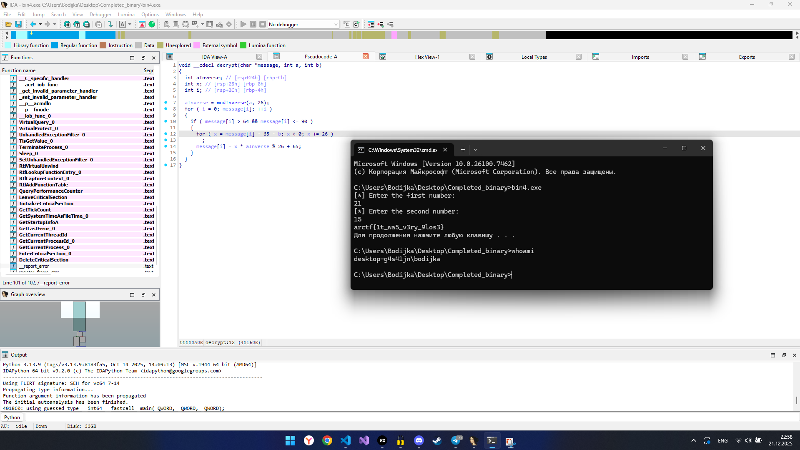

### Ответ: `arctf{1t_wa5_v3ry_9los3}`

# bin5.exe

В данном бинарнике все предельно просто, в командной строке у нас вопросы, отвечая на все правильно - получаем флаг. Используем IDA чтобы *подглядеть* ответы (можно сразу сам флаг).

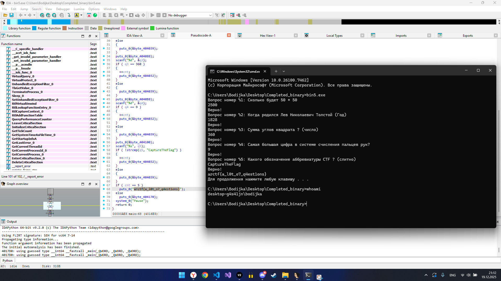


### Ответ: `arctf{a_l0t_o7_q4est1ons}`


# bin6.exe

Бин выводит нам математические примеры, отвечая на которые, заданная строка `dwfqc~0qwdkb6Zv2w4kbx` шифруется по **XOR 5**. Всего в цикле **15** примеров и каждый раз ключ кодируется\декодируется. 

Выполняем декодирование исходного ключа.

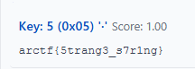

И получаем флаг:

### Ответ: `arctf{5trang3_s7r1ng}`

# bin7.exe 

Здесь уже посложнее. Прога просит 10 чисел на ввод подряд. Изучив код понимаем, что **Correct** выдается, тогда и только тогда, когда числа попарно равны. Т.е (`1 и 1`, `2 и 2`, `3 и 3` и так далее, пока не будет 5 пар таких чисел).

Так происходит потому, что программа находит XOR "первой" пары и если он равен 0 (нулю), то пара проходит проверку и идет к следующей паре чисел. А XOR равен нулю тогда, когда элементы которые мы XOR-им, равны между собой. Для решения мы пишем просто **5 пар чисел**, где **числа в парах одинаковы.**

*(Можем ввести даже просто 10 едениц подряд и все равно получим Correct)*

### Ответ: `Частный случай: 1 1 1 1 1 1 1 1 1 1` 
*Кол-во едениц = 10*

# bin8.exe

Работа бинаря несложная. Видим, такую строку.

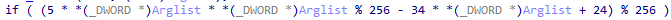

По сути, наш ввод должен удовлетворять этому условию.
Можем заменить `*(_DWORD *)Arglist` = `x`, и решить уже математическое уравнение вида: `5x² − 34x + 24 ≡ 0 (mod 256)`

Ответы, которые удовлетворяют условию **{6, 52, 134, 180}**

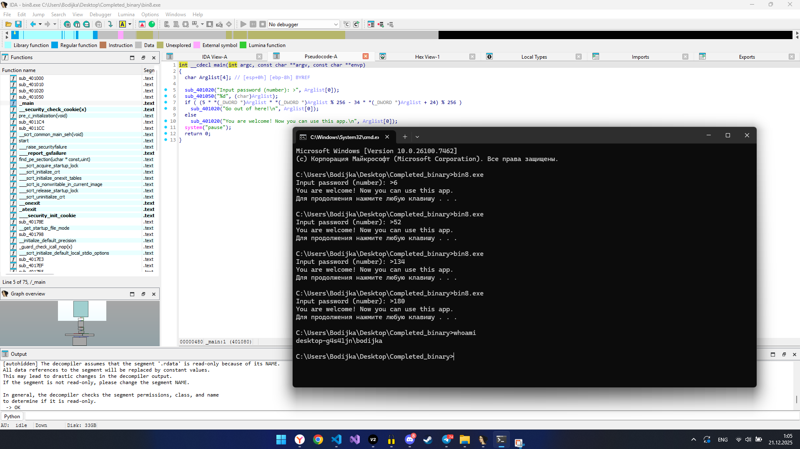

### Ответ: `Множество {6, 52, 134, 180}`

# bin10.exe

В этом случае несколько простых проверок:

- Возраст от **14** до **99**,
- Ввод текущего года. От **2017** до **2200**.

Далее идет алгоритм который ищет НОД нашего возраста и текущего года. Этот НОД должен быть равен **7**

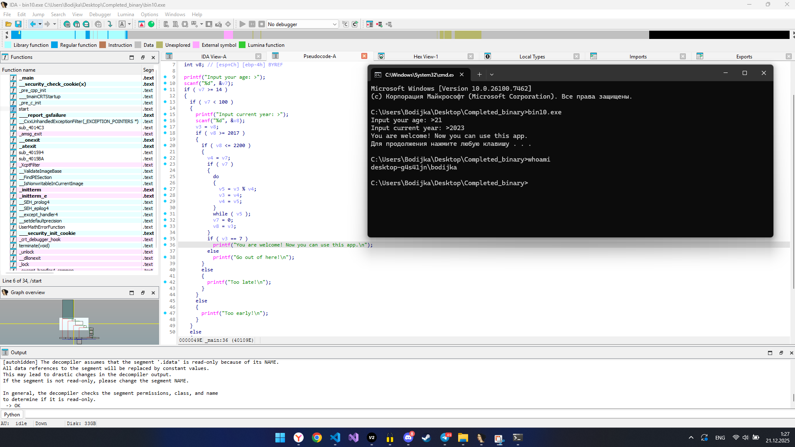

### Ответ: `Частный случай: 21 и 2023`

# bin11.exe

Изначально есть строка `"simple_answer"`, которая в процессе изменяется и принимает вид `"answer_simple"`. По сути, слова меняются местами а "разделителем служит" символ нижнего подчеркивания "_". И в итоге ввод сверяется с `"answer_simple"`

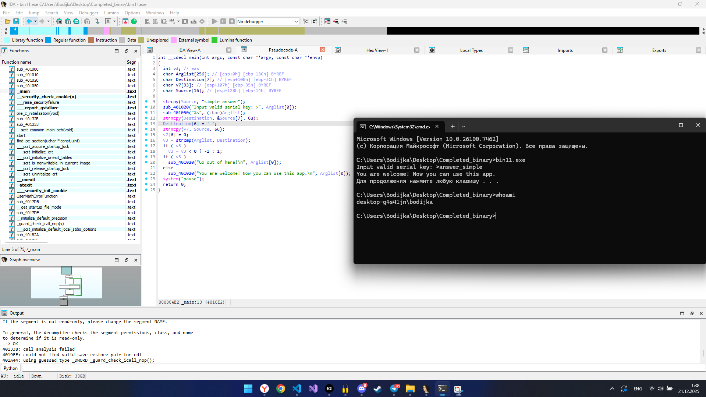

### Ответ: `answer_simple`

# bin12.exe

Бинарь читает строку, шифрует её и выводит результат в hex.

Шифрование несложное: для каждого символа генерируется случайный байт, символ сдвигается влево на `(rand_byte % 8)` бит, потом инвертируются все биты. Сохраняются два значения - шифрованный байт и случайный байт.

Функция вывода идет по этим буферам одновременно, берёт зашифрованный байт и случайный байт, печатает их подряд в hex (%02x%02x) без пробелов, останавливается на \r.

Расшифровка проста. Первый байт это шифрованный символ, второй - рандомный, от туда берем % 8 = кол-во сдвигов. Инвертируемшифрованый байт и циклический сдвиг вправо.

``` python
CIPHER = "e93cd8f4e4738b3099bc907dd3fda46365ee91c5dccb33492391a71e62363be2f8756cacdc243392233a1f1a8ce4ca77565af48b33596efa466ae9d48c5b98a4e99c94e8565a49342b89dc93e94423eeb22d496c33a9d8353e33b905331ebc5c3e73dc64e3df33ba2fba67b7c7b88cfc05c9"

def ror(val, n_bits):
    n_bits = n_bits % 8
    for _ in range(n_bits):
        lsb = val & 1
        val = (val >> 1) | (lsb << 7)
    return val & 0xFF

def recover_text(hex_data):
    output = []
    for pos in range(0, len(hex_data), 4):
        enc_byte = int(hex_data[pos:pos+2], 16)
        rand_byte = int(hex_data[pos+2:pos+4], 16)

        shift_amount = rand_byte % 8
        byte_val = (~enc_byte) & 0xFF
        byte_val = ror(byte_val, shift_amount)

        output.append(chr(byte_val))
    return "".join(output)

if __name__ == "__main__":
    flag = recover_text(CIPHER)
    print("FLAG:", flag)
```

И в итоге получаем флаг:
### Ответ: `arctf{akjsdfnav18923787jjafdnanvakjkjdasjkf9823482834187}`

# bin13.exe

При запуске бинарника необходимо указать **аргументы**, а какие - предстоит разобраться. 

В функции `decode` мы проходим по каждому аргументу и применяем `transform`, а уже в ней мы видим алгоритм: `return alph[(a3 + a2 * idx) % 29];`
Мы можем снова написать скрипт на питоне чтобы подобрать первый и второй флаги, удовлетворяющие данным условиям.

``` python
TABLE = "abcdefghijklmnopqrstuvwxyz{}_"
DATA = "dix_gyhiiz}xdduah}puvyhn}u}pxa}tnbfh}ozbc"
SIZE = len(TABLE)


def map_char(ch, a, b):
    i = TABLE.find(ch)
    if i < 0:
        return ch
    return TABLE[(a * i + b) % SIZE]


def decode_all(text, a, b):
    res = []
    for x in text:
        res.append(map_char(x, a, b))
    return "".join(res)


def looks_ok(s):
    if "{" not in s or "}" not in s:
        return False

    cnt = 0
    for c in s:
        if c.isalnum() or c in "{}_":
            cnt += 1

    return cnt * 5 >= len(s) * 4 


def run():
    found = False

    for a in range(SIZE):
        for b in range(SIZE):
            out = decode_all(DATA, a, b)
            if not looks_ok(out):
                continue

            low = out.lower()
            if "ctf" in low or "flag" in low or "arctf" in low:
                print(f"a1={TABLE[a]} a2={TABLE[b]} result={out}")
                found = True

    if not found:
        print("wrong")


if __name__ == "__main__":
    run()
```

Такие флаги **a1 = h** и **a2 = n**

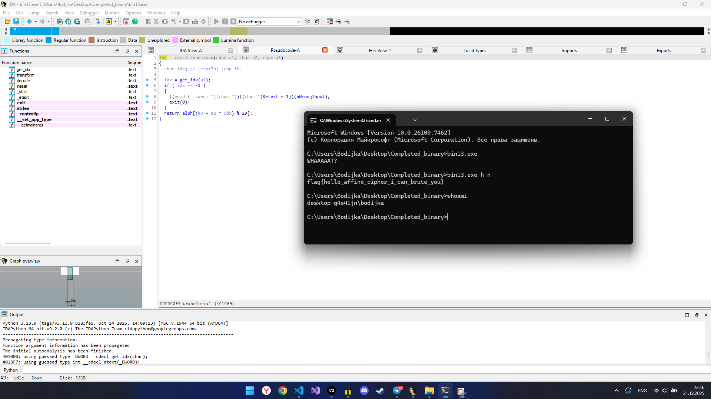

### Ответ: `flag{hello_affine_cipher_i_can_brute_you}`

# bin14.exe

Cнова видим массив и строку около которых и будет все происходить.
`v8 = [8, 7, 5, 4, 1, 3, 2, 6, 9, 10]` и  `cPK}[aYr^@ZZRC]TBP_\\Y_U`. Далее проверка на то, чтобы наш аргумент содержал только цифры. Функция берет введенную последвательность цифр и использует их как команды: на каждом шаге она меняет местами два соседних числа в массиве `v8` по указанному индексу.

После всех таких перестановок прога проверяет, получился ли отсортированый массив.
Если да, то ввод - верный, и строка расшифрвывается через XOR с нашим вводом. Ну и финал это вывод флага. 
Вновь обратимся к python для вопроизведения логики
``` python
def generate_sequence():
    numbers = [8, 7, 5, 4, 1, 3, 2, 6, 9, 10]
    operations = []
    length = len(numbers)

    for _ in range(length):
        pos = 0
        while pos < length - 1:
            if numbers[pos] > numbers[pos + 1]:
                numbers[pos], numbers[pos + 1] = numbers[pos + 1], numbers[pos]
                operations.append(str(pos))
            pos += 1

    return "".join(operations)


if __name__ == "__main__":
    result_key = generate_sequence()
    print(result_key)
```


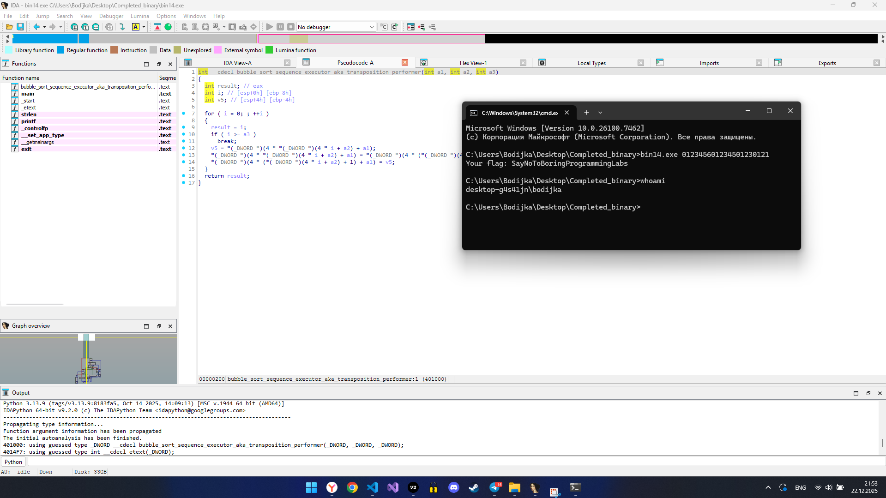

### Ответ: `SayNoToBoringProgrammingLabs`

# bin15.exe

В этом бинаре снова работа с аргументами. У нас просят аргумент при запуске, он = `str2`. И так же есть `FLAG{123REALFLAG!!!}`. Хеш функция нашего арга и `FLAG{123REALFLAG!!!}` должны быть равны, но при этом стоит учитывать проверку на то, что арг не должен с ней в точности совпадать и кратен 4. Мы видим что хеш получается разбитием арга на блоки по 4 байта, и ксорит эти блоки. Зная это, можно поменять блоки местами нашего изначального `FLAG{123REALFLAG!!!}`, либо дописать в аргумент `FLAG{123REALFLAG!!!}` какие-нибудь ОДИНАКОВЫЕ символы (обязательно соблюдая **кратность 4**).

Мы выберем самый простой вариант и просто поменяем местами то, что уже знаем. Например: `{123FLAGREALFLAG!!!}`

И получаем флаг!

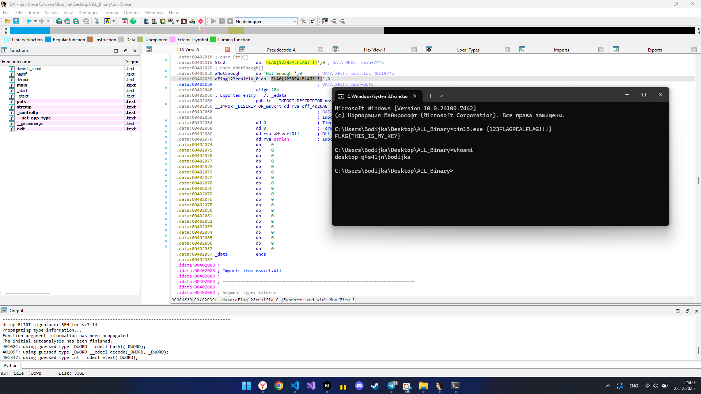

### Ответ: `FLAG{THIS_IS_MY_KEY}`
